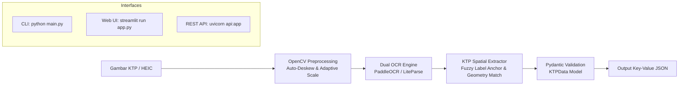

# 🪪 KTP Extractor (Local Model Prototype)

Prototype sistem ekstraksi data e-KTP Indonesia berbasis **Python** dengan model lokal (tanpa cloud SaaS API, tanpa fine-tuning, dan tanpa YOLO), mendukung dual-engine: **PaddleOCR** (Deep Learning via RapidOCR OnnxRuntime) dan **LiteParse** (`run-llama/liteparse`).

Projek ini dibangun sesuai spesifikasi penugasan **TASK 1 - SEAL Mentor**:
* **Input:** Gambar KTP (JPG, PNG, HEIC iPhone, WEBP)
* **Output:** Key-Value Pair data KTP (JSON terstruktur)
* **Model Spec:** Local Model -> OCR + Layout Extractor (Latency matters)
* **Rule:** Tanpa YOLO layout detection, tanpa fine-tuning

---

## ⚡ Arsitektur & Alur Kerja



---

## 🛠️ Tech Stack

* **Bahasa:** Python 3.11+
* **OCR Engines:**
  * **PaddleOCR (Rekomendasi Utama):** Deep learning DBNet + SVTR via `rapidocr-onnxruntime` (akurasi tinggi pada foto kamera HP/batik background).
  * **LiteParse:** Spatial grid projection parser (`run-llama/liteparse`).
* **Computer Vision:** OpenCV (`opencv-python`), Pillow (`PIL`), `pillow-heif` (dukungan foto kamera iPhone HEIC).
* **Text Matching & Normalization:** RapidFuzz (`rapidfuzz`), Regular Expressions (`re`).
* **Data Modeling & API:** Pydantic v2, FastAPI, Uvicorn.
* **Frontend:** Streamlit.

---

## 🚀 Panduan Menjalankan

### 1. Jalankan via CLI
Secara default menggunakan engine PaddleOCR:
```bash
.venv/bin/python3 main.py --image data/samples/mira_setiawan_ktp.jpg
```
Untuk menggunakan engine LiteParse:
```bash
.venv/bin/python3 main.py --image data/samples/mira_setiawan_ktp.jpg --engine liteparse
```

---

### 2. Jalankan via Web UI (Streamlit)
Cocok untuk demonstrasi visual drag-and-drop ke mentor:
```bash
.venv/bin/streamlit run app.py
```
Akses di browser: `http://localhost:8501`. Terdapat pilihan switcher engine (PaddleOCR vs LiteParse) di sidebar.

---

### 3. Jalankan via REST API (FastAPI)
Untuk integrasi backend dan dokumentasi Swagger interaktif:
```bash
.venv/bin/uvicorn api:app --host 0.0.0.0 --port 8000 --reload
```
* **Swagger Interactive Docs:** `http://localhost:8000/docs`
* **Endpoint Ekstraksi:** `POST /extract?engine=paddle` (mengirim multipart form file)

---

## 🧪 Menjalankan Automated Unit Tests
```bash
.venv/bin/python3 -m unittest discover -s tests
```
Semua test menguji validasi NIK (koreksi typo OCR), pairing koordinat spasial, pemisahan nama & tempat/tanggal lahir, serta normalisasi field.
