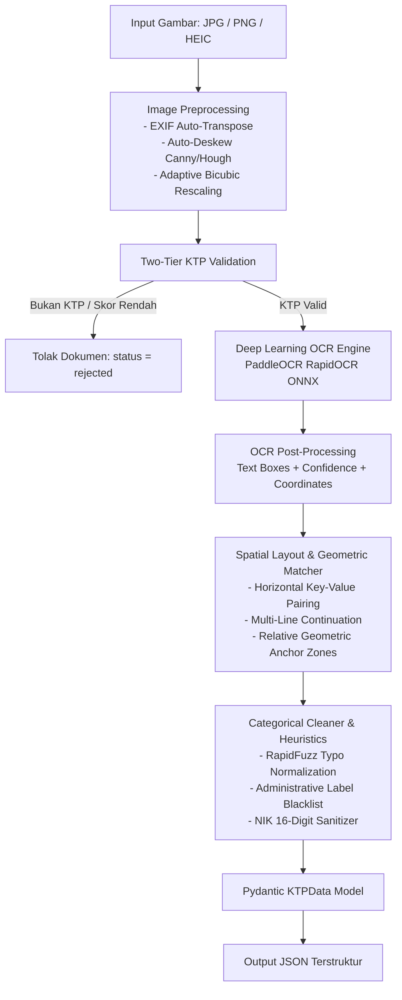

# 🪪 KTP Extractor — Local Document Information Extraction Pipeline

Sistem ekstraksi data e-KTP Indonesia berbasis **Deep Learning OCR Lokal** (tanpa Cloud SaaS API, tanpa ketergantungan LLM, dan tanpa biaya per request). Sistem ini dirancang untuk bekerja secara deterministik, privat (on-premise), dan berlatensi sub-detik (**< 1 detik per dokumen**).

Mendukung input foto kamera smartphone dalam berbagai format (**JPG, PNG, WEBP, dan HEIC iPhone**) dengan toleransi tinggi terhadap noise, foto miring, bayangan, latar belakang pola *guilloche*, dan label pudar.

---

## ⚡ Fitur Utama & Keunggulan Teknis

* **100% Pemrosesan Lokal & Aman (Privacy-First)**:
  * Tidak ada data identitas atau gambar yang dikirim ke server pihak ketiga / cloud AI.
  * Ringan dan dapat berjalan di CPU laptop standar tanpa memerlukan GPU khusus.
* **Deep Learning OCR Berkecepatan Tinggi (PaddleOCR ONNX Runtime)**:
  * Menggunakan kombinasi DBNet (Text Detection) dan SVTR/CRNN (Text Recognition) via `rapidocr-onnxruntime` yang dioptimalkan untuk font *dot-matrix* e-KTP dan pola latar belakang batik (*guilloche*).
  * 100% mandiri di atas CPU ONNX Runtime tanpa membutuhkan binary Tesseract eksternal pada level sistem operasi.
* **Two-Tier Hybrid KTP Document Validation**:
  * **Tier 1 (Visual Quality & Filter)**: Memeriksa tingkat keburaman citra (*Laplacian blur variance*), rasio aspek kartu, dan deteksi warna visual.
  * **Tier 2 (Semantic Layout Scoring)**: Menghitung kepadatan kata kunci resmi Dukcapil dan struktur dokumen untuk memfilter dan menolak otomatis dokumen non-KTP (*receipt*, SIM, dokumen acak) sebelum ekstraksi dilakukan.
* **Multi-Line Name & Faded Label Extraction**:
  * Mampu mengekstrak nama warga yang panjang hingga turun ke 2 baris (misal: `ALEXANDER KUSUMA ATMAJA`).
  * Dilengkapi **Geometric Anchor Fallback**: mengekstrak nama dan NIK berbasis zona koordinat relatif kartu meskipun label teks fisiknya pudar atau aus.
* **Tuned DBNet & Text Angle Classifier Protection**:
  * Ekspansi bounding box `OCR_DET_UNCLIP_RATIO = 2.2` untuk mencegah terpotongnya huruf kapital atau angka tepi oleh garis batik latar belakang.
  * `OCR_USE_TEXT_CLS = False` untuk mencegah pembalikan 180° (*inversion*) pada baris angka dot-matrix simetris.
* **Strict Anti-False-Positive Engine**:
  * Blacklist kata kunci administratif (`PEKERJAAN`, `KECAMATAN`, dll.) pada tempat lahir agar tanggal penerbitan kartu di bawah foto tidak tertukar dengan tempat/tanggal lahir.
  * Pengetatan aturan status perkawinan untuk mencegah kata regional (seperti `BELU` atau `BALI`) terbaca sebagai status perkawinan.
* **Categorical Normalization & Typo Healing (RapidFuzz)**:
  * Normalisasi otomatis untuk `agama`, `gol_darah`, `status_perkawinan`, dan `kewarganegaraan`.
  * Pemetaan ketat tanda strip (`-`), garis bawah (`_`), atau kolom kosong pada golongan darah menjadi `null`.
* **Dukungan Apple iPhone HEIC & Auto-Deskew**:
  * Membaca langsung format kamera iPhone (`.heic`) dengan auto-transposisi orientasi EXIF dan koreksi kemiringan sudut (*deskewing* via Canny + Hough Lines).

---

## 🏗️ Arsitektur & Alur Kerja Pipeline



---

## 📁 Struktur Direktori Proyek

```text
ktp-extractor/
├── app.py                  # Web UI interaktif berbasis Streamlit
├── api.py                  # REST API berbasis FastAPI & Uvicorn (Swagger Docs)
├── main.py                 # Command Line Interface (CLI)
├── packages.txt            # Dependensi sistem operasi Linux (libGL, libglib)
├── requirements.txt        # Dependensi pustaka Python
├── src/
│   ├── config.py           # Konfigurasi parameter pipeline & threshold OCR
│   ├── models.py           # Skema Pydantic untuk KTPData & KTPValidationResult
│   ├── preprocessor.py     # OpenCV preprocessing (deskew, scale, HEIC loader)
│   ├── validator.py        # Two-Tier Hybrid KTP Document Classifier
│   ├── paddle_parser.py    # Wrapper PaddleOCR / RapidOCR ONNX Runtime
│   ├── extractor.py        # Spatial key-value matcher, multi-line, & cleaning rules
│   └── pipeline.py         # End-to-end extraction & validation pipeline
├── tests/
│   ├── test_extractor.py   # Unit tests ekstraksi field, multi-line, & sanitasi NIK
│   └── test_validator.py   # Unit tests validasi dokumen KTP vs Non-KTP
└── data/
    └── samples/            # Sampel gambar KTP untuk pengujian
```

---

## 🛠️ Persyaratan Sistem (Prerequisites)

* **Python**: Versi 3.10 atau 3.11 (Direkomendasikan Python 3.11).
* **Sistem Operasi**: macOS, Linux (Ubuntu/Debian), atau Windows.
* **Memori (RAM)**: Minimal 2 GB RAM bebas.
* **Penyimpanan**: ~300 MB untuk virtual environment dan model ONNX.

---

## 🚀 Panduan Instalasi Lokal

### 1. Clone Repositori & Buat Virtual Environment
```bash
# Masuk ke direktori proyek
cd ktp-extractor

# Buat virtual environment
python3 -m venv .venv

# Aktifkan virtual environment
# Di macOS / Linux:
source .venv/bin/activate
# Di Windows:
# .venv\Scriptsctivate
```

### 2. Instalasi Dependensi Python
```bash
pip install --upgrade pip
pip install -r requirements.txt
```

---

## 💻 Cara Menjalankan

### 1. Menjalankan via Command Line (CLI)
Gunakan file `main.py` untuk menguji ekstraksi satu gambar secara cepat di terminal:
```bash
# Ekstraksi KTP
python main.py --image data/samples/mira_setiawan_ktp.jpg --pretty

# Menyimpan hasil ke file JSON
python main.py --image data/samples/mira_setiawan_ktp.jpg --output hasil_ekstraksi.json
```

---

### 2. Menjalankan via Web UI (Streamlit)
Antarmuka web interaktif dengan fitur drag-and-drop, pratinjau gambar, visualisasi pratinjau citra, metrik latensi, dan inspeksi validitas dokumen:
```bash
streamlit run app.py
```
Akses di browser Anda: `http://localhost:8501`

---

### 3. Menjalankan via REST API (FastAPI)
Untuk integrasi dengan sistem backend, mobile app, atau microservice:
```bash
uvicorn api:app --host 0.0.0.0 --port 8000 --reload
```
* **Swagger Interactive Docs**: Buka browser di `http://localhost:8000/docs`
* **Alternative ReDoc**: `http://localhost:8000/redoc`

#### Contoh Panggilan API via cURL:
```bash
curl -X POST "http://localhost:8000/extract"      -H "accept: application/json"      -H "Content-Type: multipart/form-data"      -F "file=@data/samples/mira_setiawan_ktp.jpg"
```

---

## 🌐 Panduan Deployment ke Production

### Opsi A: Deploy ke Streamlit Community Cloud (Gratis & Cepat)
Projek ini sudah dilengkapi dengan berkas `packages.txt` untuk memastikan pustaka grafis OpenCV berjalan tanpa kendala di container Debian Streamlit Cloud.

1. Pastikan seluruh perubahan kode sudah di-push ke GitHub:
   ```bash
   git add .
   git commit -m "feat: deployment ready ktp extractor"
   git push origin main
   ```
2. Buka dashboard [share.streamlit.io](https://share.streamlit.io/).
3. Klik **"New app"**, lalu pilih repositori dan branch Anda.
4. Tentukan **Main file path**: `app.py`.
5. Klik **"Deploy"**. Streamlit Cloud akan otomatis membaca `packages.txt` dan `requirements.txt`.

> **Catatan Dependensi OS**: Berkas `packages.txt` berisi paket sistem berikut yang wajib ada pada lingkungan Linux:
> ```text
> libgl1
> libglib2.0-0
> libsm6
> libxext6
> ```

---

### Opsi B: Deploy Menggunakan Docker (Rekomendasi Server / VPS)
Gunakan `Dockerfile` berikut untuk menjalankan container mandiri yang stabil di Docker, AWS ECS, GCP Cloud Run, atau Kubernetes:

#### Buat berkas `Dockerfile`:
```dockerfile
FROM python:3.11-slim

# Set environment variables
ENV PYTHONDONTWRITEBYTECODE=1     PYTHONUNBUFFERED=1     DEBIAN_FRONTEND=noninteractive

# Install system dependencies untuk OpenCV
RUN apt-get update && apt-get install -y --no-install-recommends     build-essential     libgl1     libglib2.0-0     libsm6     libxext6     curl     && rm -rf /var/lib/apt/lists/*

WORKDIR /app

# Install python dependencies
COPY requirements.txt .
RUN pip install --no-cache-dir -r requirements.txt

# Copy source code
COPY . .

# Expose port (8501 untuk Streamlit, 8000 untuk FastAPI)
EXPOSE 8501 8000

# Perintah default (pilih salah satu)
# Untuk menjalankan Streamlit:
CMD ["streamlit", "run", "app.py", "--server.port=8501", "--server.address=0.0.0.0"]

# Atau untuk menjalankan FastAPI:
# CMD ["uvicorn", "api:app", "--host", "0.0.0.0", "--port", "8000"]
```

#### Build & Run Container:
```bash
# Build image
docker build -t ktp-extractor:latest .

# Jalankan Streamlit container
docker run -d -p 8501:8501 --name ktp-app ktp-extractor:latest

# Atau jalankan FastAPI container
docker run -d -p 8000:8000 --name ktp-api ktp-extractor:latest uvicorn api:app --host 0.0.0.0 --port 8000
```

---

### Opsi C: Deploy ke Linux VPS (Ubuntu / Debian Server)
Jika ingin mendeploy REST API secara permanen di server Ubuntu menggunakan Systemd:

1. **Update paket server & install dependencies OS**:
   ```bash
   sudo apt update && sudo apt install -y python3-pip python3-venv libgl1 libglib2.0-0 libsm6 libxext6
   ```

2. **Setup project & virtual environment**:
   ```bash
   git clone <URL_REPO_ANDA> /opt/ktp-extractor
   cd /opt/ktp-extractor
   python3 -m venv .venv
   source .venv/bin/activate
   pip install -r requirements.txt
   ```

3. **Buat file service systemd** di `/etc/systemd/system/ktp-api.service`:
   ```ini
   [Unit]
   Description=KTP Extractor FastAPI Service
   After=network.target

   [Service]
   User=www-data
   WorkingDirectory=/opt/ktp-extractor
   ExecStart=/opt/ktp-extractor/.venv/bin/uvicorn api:app --host 0.0.0.0 --port 8000 --workers 2
   Restart=always

   [Install]
   WantedBy=multi-user.target
   ```

4. **Aktifkan dan jalankan service**:
   ```bash
   sudo systemctl daemon-reload
   sudo systemctl enable ktp-api
   sudo systemctl start ktp-api
   ```

---

## 🧪 Pengujian Otomatis (Unit Testing)

Seluruh logika ekstraksi, sanitasi NIK, pemisahan nama multi-line, dan pencegahan false-positive dicakup oleh unit tests otomatis:
```bash
.venv/bin/python3 -m unittest discover -s tests -v
```

Hasil uji:
```text
Ran 27 tests in 3.697s
OK
```

---

## 📋 Contoh Output Ekstraksi JSON

```json
{
  "nik": "3171234567890123",
  "nama": "MIRA SETIAWAN",
  "tempat_tgl_lahir": "JAKARTA, 18-02-1986",
  "jenis_kelamin": "PEREMPUAN",
  "gol_darah": "B",
  "alamat": "JL. PASTI CEPAT A7/66",
  "rt_rw": "007/008",
  "kel_desa": "PEGADUNGAN",
  "kecamatan": "KALIDERES",
  "agama": "ISLAM",
  "status_perkawinan": "KAWIN",
  "pekerjaan": "PEGAWAI SWASTA",
  "kewarganegaraan": "WNI",
  "berlaku_hingga": "22-02-2017"
}
```

---

## 📄 Lisensi & Kepatuhan Privasi

Projek ini dibangun khusus untuk kebutuhan pemrosesan data identitas lokal. Semua model dan algoritma yang digunakan bebas dari ketergantungan API pihak ketiga dan mematuhi prinsip perlindungan privasi data pribadi (*Personal Data Protection*).
